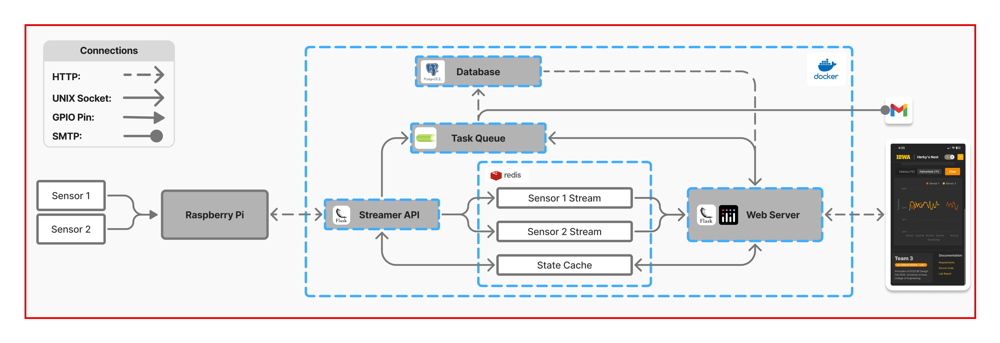
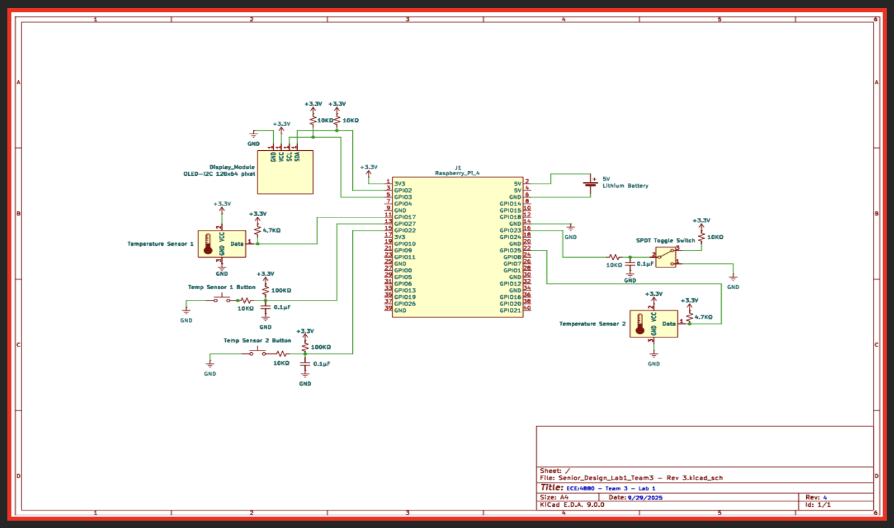
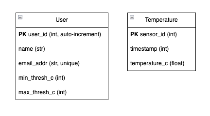
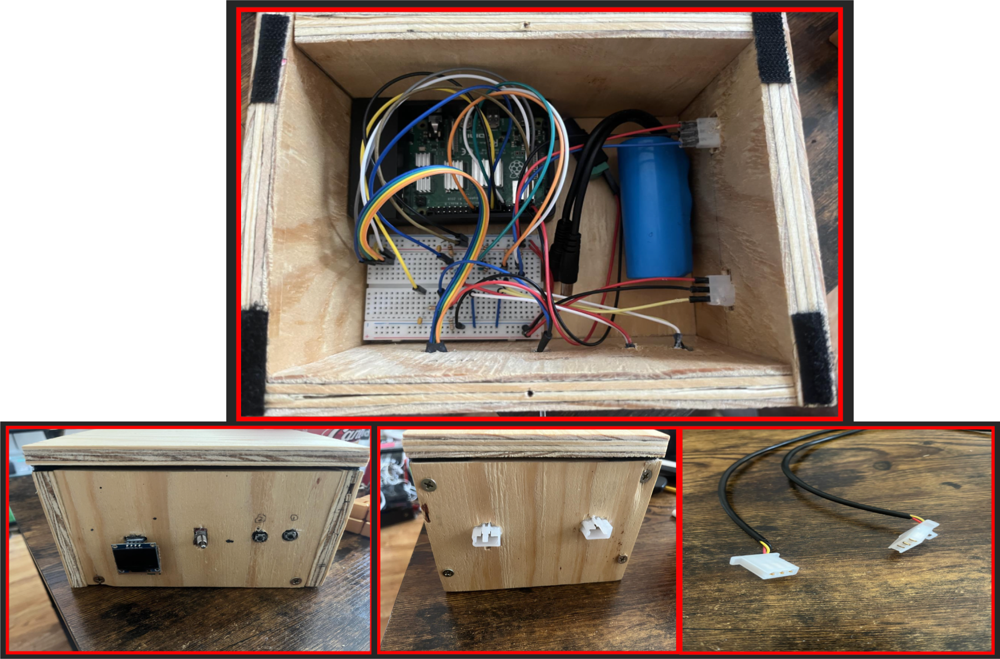
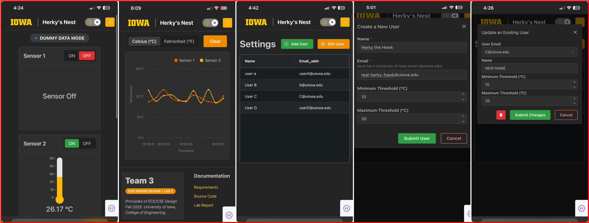
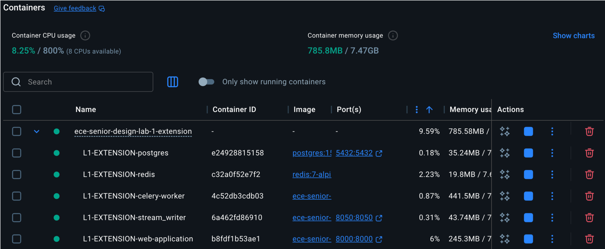

# IoT Thermostat Analytics Dashboard

# NOTICE & ACCOUNTABLITIY
This project was an extension of the Univeristy of Iowa's Senior Design, Lab 1. 

This extension project was ungraded and purely an experimental endeavor to explore Docker, task queues, Redis, and Postgres while strengthening my skills building dashboards. 

**I am responsible for 100% of the code contents within this repository**

This repository is a clone of the [ECE-Senior-Design-Lab-1-EXTENSION](https://github.com/Senior-Design-2025-2026/ECE-Senior-Design-Lab-1-EXTENSION) repository and the rest embedded code which I did not contribute to is viewable there. 

**All images and diagrams (besides the circuit Pinout diagram and images of the finished physical box) were sourced and created by me.**

[Original Embedded Code](https://github.com/Senior-Design-2025-2026/L1-embedded-thermostat) | [Original Web Application](https://github.com/Senior-Design-2025-2026/L1-web-application) 
| [ECE-Senior-Design-Lab-1-EXTENSION](https://github.com/Senior-Design-2025-2026/ECE-Senior-Design-Lab-1-EXTENSION)

# About
To move past a prototype and build a more robust system, a second application was created with support for further iterations of the project in mind. Having already completed the base requirements, this application was focused on how we to improve the system. 

Keeping the embedded system the relatively unchanged, the new software application consists of five components: a dedicated entry point for streaming data (1) into a Redis cache (2), a PostgreSQL database to store temperature readings and user information (3), and an asynchronous task queue to handle processes with high overhead – such as database calls and SMTP - in the background (4), and a web application that serves a dashboard designed for mobile devices (5). The components were containerized using Docker to for ease of development, deployment, and future scalability.  

With this extensible foundation, any smart-home application is straightforward and highly configurable; Adding an additional sensor (thermometer, humidity, air quality, etc) just means adding new endpoints to handle sensor information within the Streamer API service, creating a new stream, and creating a new table within the database. The additional sensor information can then be used for analytics and real-time operations in response to external sensor readings.  

## System Architecture
<div align="center">
  
  <div><em>System Architecture</em></div>
</div>

## Raspberry Pi Pin-Out Diagram
<div align="center">
  
  <div><em>Raspberry Pi Pin-Out Diagram</em></div>
</div>

## Database
<div align="center">
  
  <div><em>Tables</em></div>
</div>

## Finished Product
<div align="center">
  
  <div><em>Embedded System</em></div>
  <br>
</div>

<div align="center">
  
  <div><em>Web Application</em></div>
</div>

## Source Code
**Embedded System:**  
  - [Embedded Code](embedded-code/README.md)

**Software Application:**
  - Web Application  
    - [web-application](web-application/README.md)
  - Streamer API  
    - [stream-writer](stream-writer/README.md)  
  - Asynchronous Task Queue  
    - [celery-worker](celery-worker/README.md)  
  - Sqlalchemy ORM  
    - [postres-orm](postgres-orm/README.md)


# View the Application Locally
You only need to have Docker installed on your computer to run the "DUMMY DATA MODE" of the application locally. Please read the [Docker documentation](https://docs.docker.com/) on installation.

## Running the Containers:
to start the application simply run the following command
```
docker compose up
```

## Viewing the Dashboard
Running the container will expose port 8000 which your mobile device can connect to. 

To find your devices IP, use the following command:

**MacOS**: `ipconfig getifaddr en0`

**Linux**: `ip addr show`

**Windows**: `ipconfig`

Then, within your mobile browser, enter the path:

```
<IP>:8000    
```
ex: 127.0.0.1:8000 (this can be used for viewing on machine running the containers)

_(alternatively, you can open the computer running the container but the CSS is not configured for larger screens and will not look as nice)_


<div align="center">
  
  <div><em>Running Project</em></div>
</div>
