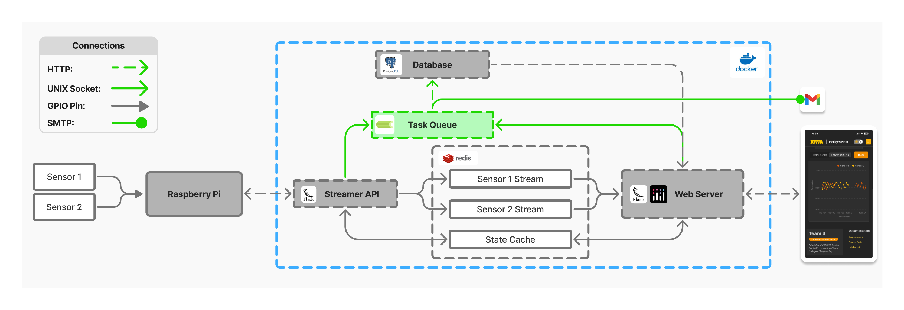

[Return to ECE-Senior-Design-Lab-1-EXTENSION -->](https://github.com/Senior-Design-2025-2026/ECE-Senior-Design-Lab-1-EXTENSION/tree/main)

# L1-EXTENSION-celery-worker
Asynchronous task queue designed to remove load from dashboard web application. Performs tasks with higher overhead that otherwise reduce the dashboards performance.

  
  
<em>System Architecture</em>

## Responsibilities
**1. Manage Database Manipulation:**
- Interfaces with PostgreSQL database
- Performs Temperature insertions
- Performs User insertions, updates, and removals

**2. Automated Emails for Critical Readings:**
- Performs data analysis to build mailing list
- Sends emails containing critical readings to alert user(s)

## Key Libraries/Services
**[Celery](https://redis.io/docs/latest/develop/data-types/streams/)**: 
- Task queue implementation
