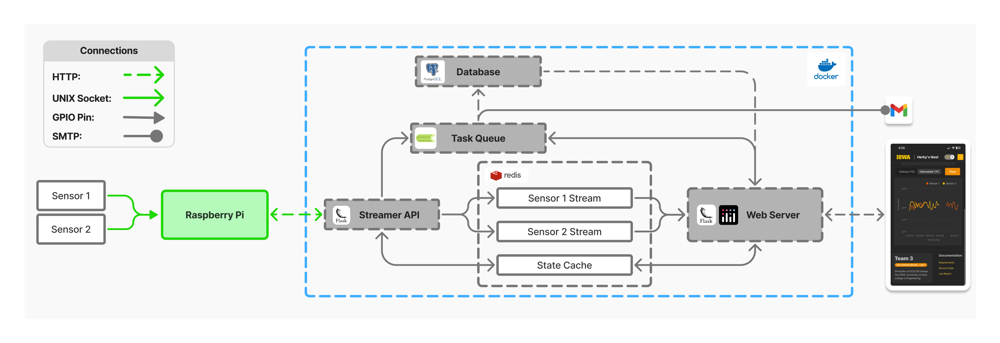

[Return to main README -->](/README.md)

# NOTICE 
I did not copy over the entire contents of this module as I was not the sole contributor of the embedded code. I did however make modifications to the main.cpp to work with the new application code I created.

My awesome team put in a lot of work to design the circuit, source parts, build the custom enclosure, and find the libries to make the embedded system work. The rest of the application code can be viewed [here](https://github.com/Senior-Design-2025-2026/ECE-Senior-Design-Lab-1-EXTENSION/tree/main/L1-EXTENSION-embedded-thermostat). 


# L1-EXTENSION-embedded Thermostat
Physical embedded system to read and send real-time temperature information. We used a Raspberry Pi 4 as our device _(having originally intending on running both the embedded code and web application on the device)_

<div align="center">
  
  <div><em>System Architecture</em></div>
  <br>
</div>

<div align="center">
  
  <div><em>Raspberry Pi Pinout</em></div>
</div>

## Responsibilities
**1. Detect Physical Temperatures:**
- Reads from attached sensors every second

**2. Post Readings to Streamer API:**
- Send temperature readings to the Streamer API be visualized downstream within the dashboard

## Key (External) Libraries
**[WiringPi](https://github.com/wiringpi):** 
- Used for physical wiring of the temperature sensor

**[Font5x7.hpp]():** 
- Writing strings to the display

**[rpi1306i2c.hpp]():** 
- I2C connection to display

# Running the Embedded Code
The program needs to know the host and port for the server it connects to.

1. **Create Host**
   ```bash
       export HOST=<server_computer_ip>
    ```

2. **Create Port**
   ```bash
       export HOST=<listening_port_of_server>
    ```

You can check that these were set correctly by running the command:

   ```bash
       echo $HOST $PORT
   ```


## Build and Run with Makefile

The easiest way to create the executable is to use the provided `Makefile`.

1. **Build**
   ```bash
       make
    ```

2. **Run**
   ```bash
       make run
    ```
