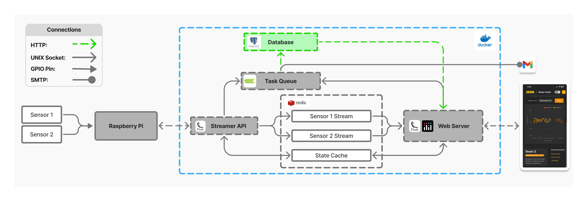
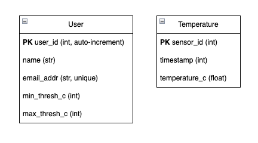

[Return to ECE-Senior-Design-Lab-1-EXTENSION -->](https://github.com/Senior-Design-2025-2026/ECE-Senior-Design-Lab-1-EXTENSION/tree/main)

# L1-EXTENSION-postgres-orm
Python module to enable interactivity with the Postgres database. This module is mounted to the "celery_worker" and "web_application" containers. The database provider chosen was Postgres (however none of this code actually specifies that). Please note that the System Architecture image is a bit deceiving here; this is a module and the actual database is its own container.

  
  
<em>System Architecture</em>

   

  
  
<em>Tables</em>

## Responsibilities
**1. Manage Database Manipulation:**
- Interfaces with PostgreSQL database
- Performs Temperature insertions
- Performs User insertions, updates, and removals

**2. Automated Emails for Critical Readings:**
- Performs data analysis to build mailing list
- Sends emails containing critical readings to alert user(s)

## Key Libraries
**[SqlAlchemy](https://www.sqlalchemy.org/)**: 
- Defining tables and datatypes
- CRUD-ing methods
