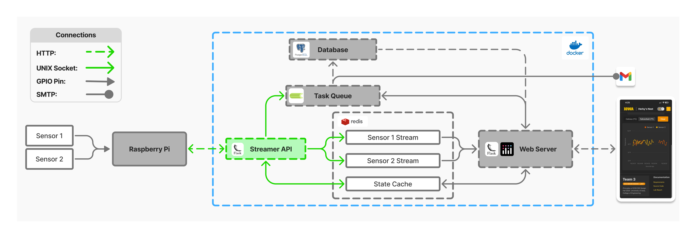

[Return to ECE-Senior-Design-Lab-1-EXTENSION -->](https://github.com/Senior-Design-2025-2026/ECE-Senior-Design-Lab-1-EXTENSION/tree/main)

# L1-EXTENSION-stream-writer
Flask server to receive and stream physical temperature readings to web server. Designed to decouple dashboard web application and physical embedded system. 

  
  
<em>System Architecture</em>

## Responsibilities
**1. Receive Temperature Readings from Embedded System:**
- Provides simple APIs for receiving readings 

**2. Virtualize Physical Embedded System Buttons:"**
- Performs virtualization logic to update the physical display

**3. Detect Critical Temperatures:**
- Compares cached user minimum and maximum thresholds to readings to determine if critical temperature reached
- Place tasks to send email in celery task queue when thresholds exceeded

## Key Libraries/Services
**[Redis Stream](https://redis.io/docs/latest/develop/data-types/streams/)**: 
- Timestamped streams for sensor data

**[Redis Cache](https://redis.io/docs/latest/develop/data-types/)**: 
- Dashboard to embedded system virtualization
- Critical reading logic
