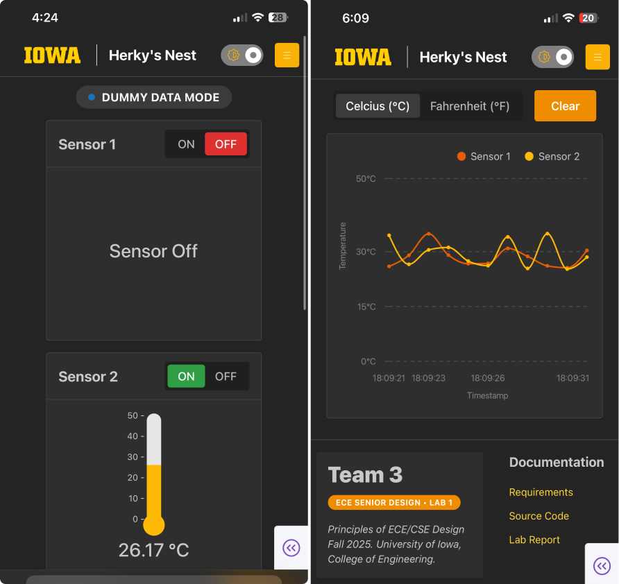

[Return to ECE-Senior-Design-Lab-1-EXTENSION -->](https://github.com/Senior-Design-2025-2026/ECE-Senior-Design-Lab-1-EXTENSION/tree/main)

# L1-EXTENSION-web-application
Plotly Dash web application designed for mobile devices to visualize sensor temperatures. Refresh rate of 1Hz.

  
  
<em>System Architecture</em>

## Responsibilities
**1. Display Real-Time Temperature Data:**
- Consume Redis Streams for thermometer sensors 1 and 2
- Serve dashboard to connected devices
- Visualize graphically using a line chart 

**2. Manage User Configurations:**
- Collect user information from PostgresSQL Database
- Interface with a asynchonous Celery server to manage database deletions, insertions, and updates

**3. Virtualize Physical Embedded System Buttons:"**
- Interface with Streamer API with a shared cache to flag user events

## Dashboard Pages

  
  
<em>Live</em>

   

  
  
<em>Settings</em>

## Key Libraries
**[Plotly Dash](https://dash.plotly.com/)**: 
- Flask web server that renders Python wrapped React components

**[Dash Mantine Components](https://www.dash-mantine-components.com/)**: 
- UI components and theme

**[Dash Core Components](https://dash.plotly.com/dash-core-components)**:
- Client side caching (dcc.Store)
- System synchronization (dcc.Interval)

**[Pandas](https://pandas.pydata.org/)**:
- Data manipulation
